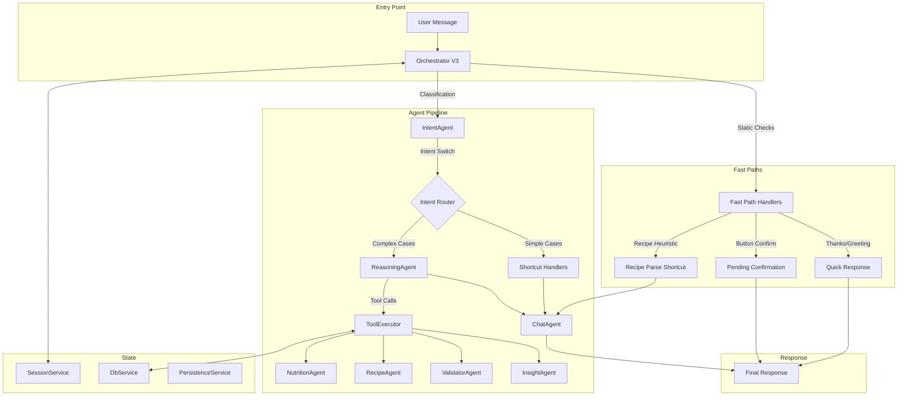
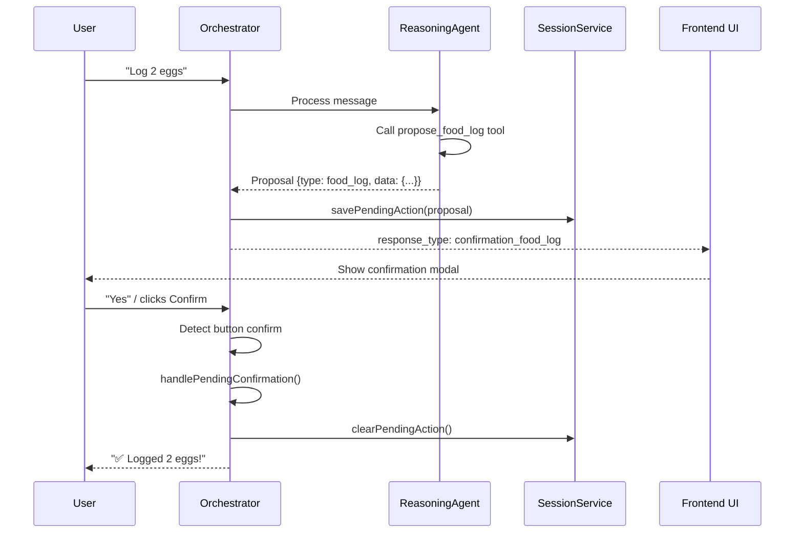
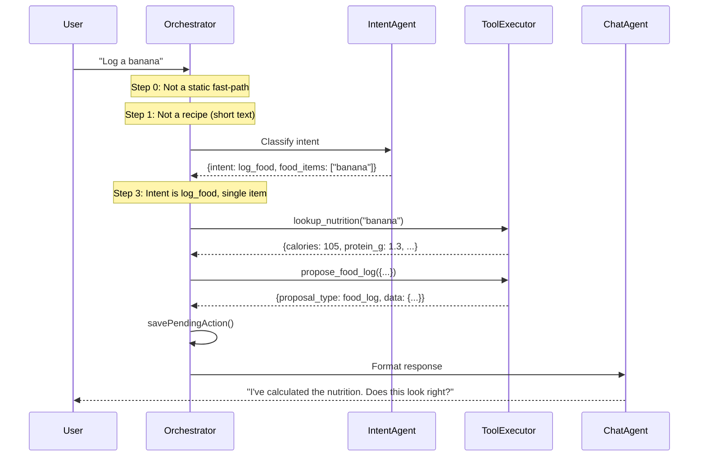
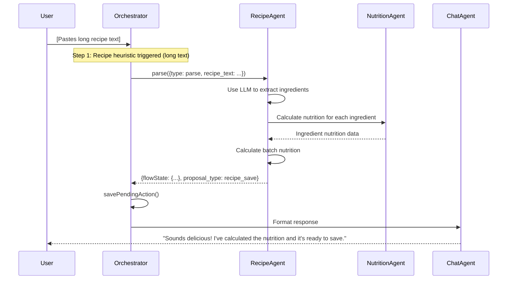
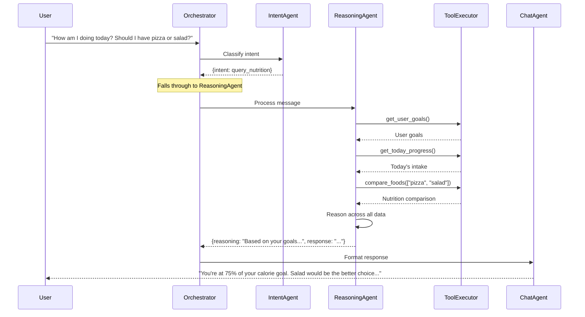

# NutriPal: Agentic Architecture

## Executive Summary

NutriPal is a nutrition tracking app powered by a **hybrid multi-agent system**. The architecture combines fast deterministic routing with intelligent AI-driven orchestration to handle everything from simple food logging to complex recipe parsing.

- **7 specialized agents**: Each handles a distinct domain (intent classification, reasoning, chat, recipes, nutrition, validation, insights)
- **21 tools across 6 categories**: Exposed via OpenAI function calling to enable intelligent orchestration
- **PCC Pattern**: Propose-Confirm-Commit ensures users verify actions before data is saved
- **Session Management**: Persistent conversation state enables multi-turn interactions

---

## Architecture Overview

---

## The 7 Agents

### 1. IntentAgent

**Purpose**: Fast, cheap intent classification using GPT-4o-mini.

**Model**: `gpt-4o-mini`

**Location**: [intent-agent.ts](file:///c:/Users/ianku/Desktop/cursor%20projects/Joshs%20Food%20App/supabase/functions/chat-handler/agents/intent-agent.ts)

**Capabilities**:
- Classifies user messages into one of 12 intent categories
- Extracts food items, portions, calories, macros from messages
- Returns structured JSON with intent classification and entities

**Intents**:
| Intent | Description |
|--------|-------------|
| `log_food` | User wants to log a food item |
| `log_recipe` | User wants to log a saved recipe |
| `save_recipe` | User wants to save a new recipe |
| `query_nutrition` | User asking about nutritional content |
| `update_goals` | User wants to edit goals |
| `suggest_goals` | User wants goal recommendations |
| `clarify` | User providing missing info |
| `modify` | User changing/correcting info |
| `confirm` | User agreeing to pending action |
| `decline` | User rejecting action |
| `greet` | Hello/greeting |
| `off_topic` | Unrelated message |

---

### 2. ReasoningAgent

**Purpose**: The intelligent orchestrator that uses OpenAI function calling to coordinate complex tasks.

**Model**: `gpt-4o`

**Location**: [reasoning-agent.ts](file:///c:/Users/ianku/Desktop/cursor%20projects/Joshs%20Food%20App/supabase/functions/chat-handler/agents/reasoning-agent.ts)

**Capabilities**:
- Receives classified intent from IntentAgent
- Calls tools iteratively to gather data (up to 5 iterations)
- Reasons across all gathered information
- Generates proposals for user confirmation (PCC pattern)
- Passes results to ChatAgent for formatting

**Key Behaviors**:
- **Context First**: Always calls `get_user_goals` and `get_today_progress` for diet-related queries
- **Action Oriented**: Uses `propose_food_log`, `parse_recipe_text`, or `propose_recipe_log` to trigger confirmations
- **Smart Comparisons**: Calls `compare_foods` or `lookup_nutrition` for food comparisons

---

### 3. ChatAgent

**Purpose**: Final response formatting with personality.

**Model**: `gpt-4o-mini`

**Location**: [chat-agent.ts](file:///c:/Users/ianku/Desktop/cursor%20projects/Joshs%20Food%20App/supabase/functions/chat-handler/agents/chat-agent.ts)

**Capabilities**:
- Converts reasoning output into user-friendly messages
- Maintains NutriPal personality (friendly, encouraging, concise)
- Never repeats nutrition numbers (UI handles display)
- Provides coaching tips based on goals and progress

---

### 4. RecipeAgent

**Purpose**: Recipe parsing, saving, finding, and nutrition calculation.

**Location**: [recipe-agent.ts](file:///c:/Users/ianku/Desktop/cursor%20projects/Joshs%20Food%20App/supabase/functions/chat-handler/agents/recipe-agent.ts)

**Capabilities**:
- **Parse**: Converts recipe text into structured ingredients list
- **Find**: Searches saved recipes by name or fingerprint
- **Save/Update**: Persists recipes to database with nutrition data
- **Calculate**: Computes batch and per-serving nutrition
- **Fingerprinting**: Generates normalized fingerprints for duplicate detection

**Actions**:
| Type | Description |
|------|-------------|
| `parse` | Parse recipe text into ingredients |
| `find` | Search saved recipes by name |
| `save` | Save new recipe |
| `update` | Update existing recipe |
| `handle_duplicate` | Process duplicate recipe choice (log/update/new) |
| `details` | Get full recipe details |
| `calculate_serving` | Scale nutrition to specific serving size |

---

### 5. NutritionAgent

**Purpose**: Nutrition lookup and LLM-based estimation.

**Location**: [nutrition-agent.ts](file:///c:/Users/ianku/Desktop/cursor%20projects/Joshs%20Food%20App/supabase/functions/chat-handler/agents/nutrition-agent.ts)

**Capabilities**:
- **Lookup**: Queries external nutrition database
- **Estimate**: Uses LLM to estimate nutrition when database lookup fails
- **Scale**: Scales nutrition data by portion multiplier
- **Validate**: Checks for valid nutrition data (non-zero calories for caloric foods)

**Features**:
- Fallback nutrition for common items
- Unit conversion (grams, ml, cups, tablespoons, etc.)
- Tracks failed lookups for analytics

---

### 6. ValidatorAgent

**Purpose**: Validates nutrition data accuracy and consistency.

**Location**: [validator-agent.ts](file:///c:/Users/ianku/Desktop/cursor%20projects/Joshs%20Food%20App/supabase/functions/chat-handler/agents/validator-agent.ts)

**Capabilities**:
- **Range Checks**: Ensures values are non-negative
- **Consistency Checks**: Validates calories match macro calculation (P×4 + C×4 + F×9)
- **Reasonableness Checks**: Flags unusually high values (>2500 cal, >5000mg sodium)
- **Anti-Ghost-Calorie Guard**: Rejects 0-calorie foods that should have calories (chicken, eggs, etc.)
- **Goal Validation**: Validates goal updates are reasonable

---

### 7. InsightAgent

**Purpose**: Generates daily insights and nutrition suggestions.

**Location**: [insight-agent.ts](file:///c:/Users/ianku/Desktop/cursor%20projects/Joshs%20Food%20App/supabase/functions/chat-handler/agents/insight-agent.ts)

**Capabilities**:
- Calculates today's totals and progress
- Computes 7-day averages
- Generates 2 short, actionable suggestions using LLM
- Identifies patterns and trends

---

## Orchestrator (orchestrator_v3.ts)

The [orchestrator_v3.ts](file:///c:/Users/ianku/Desktop/cursor%20projects/Joshs%20Food%20App/supabase/functions/chat-handler/orchestrator_v3.ts) is the central routing function that coordinates all agents.

### Flow Stages

### Step 0: Static Fast-Paths

Handles common patterns without AI calls:

| Pattern | Response |
|---------|----------|
| Thanks keywords (`thanks`, `thx`, `cheers`) | Quick acknowledgment |
| Button confirm (`yes`, `log it`, `confirm`) | Process pending action |
| Button cancel (`no`, `cancel`, `stop`) | Clear pending action |

### Step 1: Recipe Heuristic

Detects long text that looks like a recipe (>200 chars OR multiple lines) and routes directly to recipe parsing, bypassing intent classification.

### Step 2: IntentAgent Classification

Calls IntentAgent to classify the user's intent.

### Step 3: Intent Switchboard

Routes based on intent:

| Intent | Route |
|--------|-------|
| `greet` | Direct to ChatAgent |
| `confirm` | Handle pending confirmation |
| `decline`/`cancel` | Clear pending action |
| `log_food` (simple) | Shortcut with priority recipe check |
| `log_recipe` | Search saved recipes or parse |
| `save_recipe` | Parse recipe text |
| Other | Fall through to ReasoningAgent |

### Step 4: ReasoningAgent Fallback

For complex queries, ReasoningAgent uses tool calling to:
1. Gather context (goals, progress)
2. Query specialized agents via tools
3. Generate proposals if needed
4. Return reasoning for ChatAgent

### Step 5: ChatAgent Formatting

Formats the final response with personality and coaching tips.

---

## Tools (21 Tools in 6 Categories)

Tools are defined in [tools.ts](file:///c:/Users/ianku/Desktop/cursor%20projects/Joshs%20Food%20App/supabase/functions/chat-handler/services/tools.ts) and executed by [tool-executor.ts](file:///c:/Users/ianku/Desktop/cursor%20projects/Joshs%20Food%20App/supabase/functions/chat-handler/services/tool-executor.ts).

### Category 1: User Context (5 tools)

| Tool | Description |
|------|-------------|
| `get_user_profile` | Get user profile and preferences |
| `get_user_goals` | Get all nutrition goals |
| `get_today_progress` | Get today's intake vs goals |
| `get_weekly_summary` | Get 7-day averages and trends |
| `get_food_history` | Get recent food logs |

### Category 2: Nutrition (4 tools)

| Tool | Description |
|------|-------------|
| `lookup_nutrition` | Look up nutrition from database |
| `estimate_nutrition` | LLM-based estimation for unknown foods |
| `validate_nutrition` | Check data accuracy |
| `compare_foods` | Compare nutrition of multiple foods |

### Category 3: Recipes (4 tools)

| Tool | Description |
|------|-------------|
| `search_saved_recipes` | Find saved recipes by name |
| `get_recipe_details` | Get full recipe data |
| `parse_recipe_text` | Parse recipe text to structured format |
| `calculate_recipe_serving` | Scale recipe to specific servings |

### Category 4: Logging (3 tools)

| Tool | Description |
|------|-------------|
| `propose_food_log` | Propose logging a food (triggers confirmation UI) |
| `propose_recipe_log` | Propose logging a recipe (triggers confirmation UI) |
| `apply_daily_workout_offset` | Add workout adjustment to daily targets |

### Category 5: Goals (2 tools)

| Tool | Description |
|------|-------------|
| `update_user_goal` | Update a nutrition goal |
| `calculate_recommended_goals` | Get AI-recommended goals |

### Category 6: Insights (3 tools)

| Tool | Description |
|------|-------------|
| `get_food_recommendations` | Get food suggestions based on goals |
| `analyze_eating_patterns` | Analyze eating behavior patterns |
| `get_progress_report` | Get comprehensive progress report |

---

## Services

### SessionService

**Location**: [session-service.ts](file:///c:/Users/ianku/Desktop/cursor%20projects/Joshs%20Food%20App/supabase/functions/chat-handler/services/session-service.ts)

Manages conversation state in the `chat_sessions` table:
- `getSession` / `createSession` / `updateSession`
- `savePendingAction` / `clearPendingAction` (for PCC pattern)
- `updateContext` (tracks last intent, agent, response type)
- `updateBuffer` (conversation context preservation)
- `addUserCorrection` (learns from user corrections)

### DbService

**Location**: [db-service.ts](file:///c:/Users/ianku/Desktop/cursor%20projects/Joshs%20Food%20App/supabase/functions/chat-handler/services/db-service.ts)

Database operations for:
- User goals (`getUserGoals`, `updateUserGoal`)
- Food logs (`logFoodItems`)
- Recipes and profiles

### PersistenceService

**Location**: [persistence-service.ts](file:///c:/Users/ianku/Desktop/cursor%20projects/Joshs%20Food%20App/supabase/functions/chat-handler/services/persistence-service.ts)

Logs execution analytics for debugging and monitoring.

---

## The PCC Pattern (Propose-Confirm-Commit)

The Propose-Confirm-Commit pattern ensures users verify actions before data is saved:

### Pending Action Types

| Type | Description |
|------|-------------|
| `food_log` | Single food item log |
| `recipe_log` | Log saved recipe |
| `recipe_save` | Save new/updated recipe |
| `recipe_selection` | Choose from multiple matching recipes |
| `goal_update` | Update a nutrition goal |

---

## Message Flow Examples

### Example 1: Simple Food Log

### Example 2: Recipe Parsing

### Example 3: Complex Query (ReasoningAgent)

---

## Data Flow

### Nutrition Tracking (40+ nutrients)

The system tracks a comprehensive set of nutrients:

| Category | Nutrients |
|----------|-----------|
| **Core Macros** | calories, protein_g, carbs_g, fat_total_g |
| **Hydration** | hydration_ml |
| **Fat Breakdown** | fat_saturated_g, fat_poly_g, fat_mono_g, fat_trans_g, omega_3_g, omega_6_g |
| **Carb Breakdown** | fiber_g, fiber_soluble_g, sugar_g, sugar_added_g |
| **Minerals** | sodium_mg, potassium_mg, calcium_mg, iron_mg, magnesium_mg, phosphorus_mg, zinc_mg, copper_mg, manganese_mg, selenium_mcg |
| **Vitamins** | vitamin_a_mcg, vitamin_c_mg, vitamin_d_mcg, vitamin_e_mg, vitamin_k_mcg, thiamin_mg, riboflavin_mg, niacin_mg, pantothenic_acid_mg, vitamin_b6_mg, biotin_mcg, folate_mcg, vitamin_b12_mcg |
| **Other** | cholesterol_mg |

### Goal System

Users can set goals for any tracked nutrient with:
- Target value and unit
- Goal type (`goal` = minimum target, `limit` = maximum limit)
- Color thresholds (`yellow_min`, `green_min`, `red_min`)

---

## Technology Stack

| Component | Technology |
|-----------|------------|
| Runtime | Deno (Supabase Edge Functions) |
| Database | Supabase (PostgreSQL) |
| AI Models | OpenAI (gpt-4o, gpt-4o-mini) |
| Nutrition Data | External nutrition lookup service |
| State Management | Supabase tables (chat_sessions, pending actions) |

---

## Key Files Reference

| File | Purpose |
|------|---------|
| [orchestrator_v3.ts](file:///c:/Users/ianku/Desktop/cursor%20projects/Joshs%20Food%20App/supabase/functions/chat-handler/orchestrator_v3.ts) | Main entry point and routing |
| [intent-agent.ts](file:///c:/Users/ianku/Desktop/cursor%20projects/Joshs%20Food%20App/supabase/functions/chat-handler/agents/intent-agent.ts) | Intent classification |
| [reasoning-agent.ts](file:///c:/Users/ianku/Desktop/cursor%20projects/Joshs%20Food%20App/supabase/functions/chat-handler/agents/reasoning-agent.ts) | Intelligent orchestration |
| [chat-agent.ts](file:///c:/Users/ianku/Desktop/cursor%20projects/Joshs%20Food%20App/supabase/functions/chat-handler/agents/chat-agent.ts) | Response formatting |
| [recipe-agent.ts](file:///c:/Users/ianku/Desktop/cursor%20projects/Joshs%20Food%20App/supabase/functions/chat-handler/agents/recipe-agent.ts) | Recipe operations |
| [nutrition-agent.ts](file:///c:/Users/ianku/Desktop/cursor%20projects/Joshs%20Food%20App/supabase/functions/chat-handler/agents/nutrition-agent.ts) | Nutrition lookup |
| [validator-agent.ts](file:///c:/Users/ianku/Desktop/cursor%20projects/Joshs%20Food%20App/supabase/functions/chat-handler/agents/validator-agent.ts) | Data validation |
| [insight-agent.ts](file:///c:/Users/ianku/Desktop/cursor%20projects/Joshs%20Food%20App/supabase/functions/chat-handler/agents/insight-agent.ts) | Insights generation |
| [tools.ts](file:///c:/Users/ianku/Desktop/cursor%20projects/Joshs%20Food%20App/supabase/functions/chat-handler/services/tools.ts) | Tool definitions |
| [tool-executor.ts](file:///c:/Users/ianku/Desktop/cursor%20projects/Joshs%20Food%20App/supabase/functions/chat-handler/services/tool-executor.ts) | Tool execution |
| [session-service.ts](file:///c:/Users/ianku/Desktop/cursor%20projects/Joshs%20Food%20App/supabase/functions/chat-handler/services/session-service.ts) | Session management |
| [db-service.ts](file:///c:/Users/ianku/Desktop/cursor%20projects/Joshs%20Food%20App/supabase/functions/chat-handler/services/db-service.ts) | Database operations |
