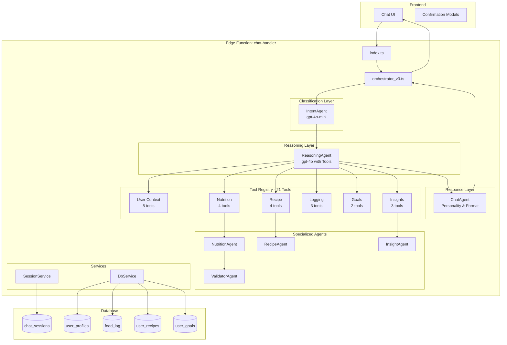

# NutriPal Development Plan

> **Last Updated:** 2026-01-30
> **Status:** Active Development
> **Goal:** Transform NutriPal into a reliable, conversational AI nutrition assistant

---

## Executive Summary

NutriPal aims to be a conversational AI food tracker where users can naturally chat to log food, manage recipes, set goals, and get insights. The current implementation has a solid foundation with a multi-agent architecture but suffers from critical bugs that break basic functionality.

This plan provides a phased approach to:
1. Fix critical blocking bugs (nutrition data, intent classification)
2. Strengthen the context/memory system
3. Complete core features with the Propose-Confirm-Commit pattern
4. Polish the conversational experience
5. Establish robust testing and monitoring

---

## Current State Assessment

### ✅ What Works
- **Agent Infrastructure**: 7 agents deployed (Intent, Planner, Chat, Nutrition, Recipe, Validator, Insight)
- **Session State**: `SessionService` tracks mode, buffer, pending actions
- **Database**: Comprehensive schema with RLS policies
- **Frontend**: Chat UI with confirmation modals for food/recipe logging

### ❌ Critical Issues

#### Issue 1: Rigid Intent Classification (Architectural)
**Example:** User says "based on my goals and what I've eaten, can I eat a donut?"
- **Problem:** This doesn't fit ANY single intent category
- **Current Behavior:** IntentAgent picks wrong category, user gets unhelpful response
- **Impact:** System feels like a dumb chatbot, not an AI assistant

#### Issue 2: No Multi-Step Reasoning
**Example:** Same question requires: get goals → get today's progress → get donut nutrition → reason → recommend
- **Problem:** Current if-else routing can't chain multiple data sources
- **Impact:** Can't provide intelligent, personalized advice

#### Issue 3: Nutrition Data Failures
**Example:** "log an apple" → Shows 1 kcal, 0g macros
- **Problem:** API failing silently, no validation blocking bad data
- **Impact:** Users logging incorrect calories


---

## The Solution: Hybrid Multi-Agent Architecture

Keep all specialized agents but add **ReasoningAgent** as an intelligent orchestrator:

```
User Message → IntentAgent → ReasoningAgent (with tools) → [Specialized Agents via tools] → ChatAgent → Response
```

### Key Principles
1. **IntentAgent** - Fast, cheap classification still helps with routing and context
2. **ReasoningAgent** - The "brain" that decides what tools/agents to call
3. **Specialized Agents** - Keep their expertise (NutritionAgent, RecipeAgent, etc.)
4. **Tools** - Bridge between ReasoningAgent and specialized agents/data
5. **ChatAgent** - Consistent personality and response formatting

---

## New Architecture



---

## Agent Responsibilities

| Agent | Role | Model | Status |
|-------|------|-------|--------|
| **IntentAgent** | Fast classification, context hints | gpt-4o-mini | KEEP |
| **ReasoningAgent** | Tool orchestration, multi-step reasoning | gpt-4o | NEW |
| **NutritionAgent** | Nutrition lookup, APIs, LLM estimation | - | KEEP |
| **RecipeAgent** | Recipe parsing, matching, management | - | KEEP |
| **ValidatorAgent** | Data validation, blocking bad data | - | KEEP |
| **InsightAgent** | Analytics, trends, recommendations | - | KEEP |
| **ChatAgent** | Response formatting, personality | gpt-4o-mini | KEEP |
| ~~PlannerAgent~~ | ~~Routing decisions~~ | - | DEPRECATE (absorbed into ReasoningAgent) |

---

## Complete Tool Registry (21 Tools)

### Category 1: User Context (5 tools)
| Tool | Description | Data Source |
|------|-------------|-------------|
| `get_user_profile()` | Age, height, weight, activity level, dietary preferences | `user_profiles` |
| `get_user_goals()` | All nutrition targets (calories, macros) | `user_goals` |
| `get_today_progress()` | Today's consumption totals | `food_log` (today) |
| `get_weekly_summary()` | 7-day averages, trends, compliance % | Reuses existing dashboard aggregation logic |
| `get_food_history(days)` | Detailed log history for pattern analysis | `food_log` (historical) |

### Category 2: Nutrition (4 tools) - Wraps NutritionAgent
| Tool | Description | Internal Agent |
|------|-------------|----------------|
| `lookup_nutrition(food, portion?)` | Look up nutrition from APIs/cache | NutritionAgent |
| `estimate_nutrition(description)` | LLM-based estimation for unknown foods | NutritionAgent |
| `validate_nutrition(data)` | Check if nutrition data is reasonable | ValidatorAgent |
| `compare_foods(foods[])` | Compare nutrition of multiple foods | NutritionAgent |

### Category 3: Recipes (4 tools) - Wraps RecipeAgent
| Tool | Description | Internal Agent |
|------|-------------|----------------|
| `search_saved_recipes(query)` | Find user's saved recipes | RecipeAgent |
| `get_recipe_details(id)` | Full recipe with ingredients and nutrition | RecipeAgent |
| `parse_recipe_text(text)` | Parse recipe from natural language | RecipeAgent |
| `calculate_recipe_serving(recipe, portion)` | Scale nutrition for portions | RecipeAgent |

### Category 4: Logging (3 tools) - PCC Pattern
| Tool | Description | Returns |
|------|-------------|---------|
| `propose_food_log(food, nutrition)` | Create food log proposal | Proposal card data |
| `propose_recipe_log(recipe_id, servings)` | Create recipe log proposal | Proposal card data |
| `confirm_pending_log()` | Handle user confirmation | Success/failure |

### Category 5: Goals (2 tools)
| Tool | Description | Notes |
|------|-------------|-------|
| `update_user_goal(nutrient, value)` | Propose goal change | Requires confirmation |
| `calculate_recommended_goals()` | Calculate TDEE-based recommendations | Uses profile data |

### Category 6: Insights (3 tools) - Wraps InsightAgent
| Tool | Description | Internal Agent |
|------|-------------|----------------|
| `get_food_recommendations(needs)` | Suggest foods to meet goals | InsightAgent |
| `analyze_eating_patterns()` | Identify trends and habits | InsightAgent |
| `get_progress_report()` | Comprehensive progress summary | InsightAgent |

---

## Example: How Agents Work Together

**User:** "Based on my goals, can I have pizza tonight?"

### Step 1: IntentAgent (Fast Classification)
```json
{
  "intent": "dietary_advice",
  "requires_reasoning": true,
  "entities": ["pizza", "tonight"]
}
```
*Uses gpt-4o-mini - fast and cheap*

### Step 2: ReasoningAgent (Tool Orchestration)
ReasoningAgent receives intent + message. User said "my goals" so it knows to fetch profile and goals:

**Tool Calls:**
1. `get_user_profile()` → {height: 175cm, weight: 85kg, goal: "lose weight"} ← **Infers weight loss goal from profile**
2. `get_user_goals()` → {calories: 1800, protein: 120g}
3. `get_weekly_summary()` → {avg_calories: 2100, trend: "over by 300 kcal avg"} ← **Reuses dashboard aggregation**
4. `lookup_nutrition("pizza", "2 slices")` → NutritionAgent → {calories: 550, protein: 22g}

**Internal Reasoning:**
"User's profile shows weight loss goal. They're over target this week. Pizza adds 550 calories. Suggest alternatives or smaller portion."

### Step 3: ChatAgent (Response Formatting)
```json
{
  "reasoning": "User over target, pizza adds 550cal, suggest alternatives",
  "recommendation": "reduce_or_substitute",
  "data": { /* all fetched data */ }
}
```

**Final Response:**
> "Hey! 🍕 Looking at your week, you've been about 300 calories over target on average. Two slices of pizza would add around 550 calories tonight. To stay on track with your weight loss goal:
> 1. Have just one slice (~275 cal) with a big salad
> 2. Skip tonight and have it as a weekend treat  
> 3. Do a lighter lunch tomorrow to balance it out
>
> What sounds good to you?"

**THIS is intelligent AI cooperation!**

---

### Core Patterns

#### Tool-Based Reasoning
The ReasoningAgent orchestrates by:
- **Understanding** what data is needed via IntentAgent context
- **Gathering** data through tool calls to specialized agents
- **Reasoning** across all the data
- **Delegating** response formatting to ChatAgent

#### Propose-Confirm-Commit (PCC)
Data-modifying actions still follow PCC:
1. `propose_food_log` / `propose_recipe_log` tools return proposal data
2. Frontend shows confirmation card
3. User confirms → Backend commits via `confirm_pending_log`

---

## Development Phases

---

## Phase 0: Foundation
> **Duration:** 1-2 hours | **Priority:** Setup

### Tasks

- [ ] **0.1** Archive `dev-todo.md` (this document replaces it)

- [ ] **0.2** Update `Agentic architecture.md` to reflect new Tool-First design

- [ ] **0.3** Create `services/tools.ts` file structure for tool implementations

---

## Phase 1: Implement Hybrid Multi-Agent Architecture
> **Duration:** 8-10 hours | **Priority:** CRITICAL - Core architectural upgrade

This phase adds the ReasoningAgent to orchestrate existing agents through tools, enabling intelligent multi-step reasoning while preserving specialized agent expertise.

**Flow:** `User Message → IntentAgent → ReasoningAgent (with tools) → [Specialized Agents via tools] → ChatAgent → Response`

### Tasks

- [x] **1.1** Create Tool Definitions (21 tools across 6 categories) → `services/tools.ts`
- [x] **1.2** Implement Tool Executors (wraps existing agents) → `services/tool-executor.ts`
- [x] **1.3** Create ReasoningAgent (GPT-4o with function calling) → `agents/reasoning-agent.ts`
- [x] **1.4** Update Orchestrator (new flow) → `orchestrator_v3.ts`
- [x] **1.5** Fix Nutrition Data Validation → `tool-executor.ts`
- [x] **1.6** Deploy and Test (v50 deployed, responding with 200s)

---

### 1.1 Create Tool Definitions (21 tools across 6 categories)

**File:** `packages/supabase/functions/chat-handler/services/tools.ts`

Define all tools the ReasoningAgent can call. Tools wrap existing agents and services:


```typescript
export const toolDefinitions = [
  {
    type: "function",
    function: {
      name: "get_user_goals",
      description: "Retrieves the user's nutrition goals/targets (calories, protein, carbs, fat, sugar, etc.)",
      parameters: { type: "object", properties: {}, required: [] }
    }
  },
  {
    type: "function",
    function: {
      name: "get_today_progress",
      description: "Gets the user's food log totals for today (what they've already eaten)",
      parameters: { type: "object", properties: {}, required: [] }
    }
  },
  {
    type: "function",
    function: {
      name: "lookup_nutrition",
      description: "Looks up nutrition information for a food item. Use this before proposing to log food.",
      parameters: {
        type: "object",
        properties: {
          food: { type: "string", description: "The food to look up (e.g., 'apple', 'chicken breast')" },
          portion: { type: "string", description: "Optional portion size (e.g., 'medium', '4oz', '1 cup')" }
        },
        required: ["food"]
      }
    }
  },
  {
    type: "function",
    function: {
      name: "propose_food_log",
      description: "Proposes logging a food item. The user will see a confirmation card and must approve before it's saved.",
      parameters: {
        type: "object",
        properties: {
          food_name: { type: "string" },
          portion: { type: "string" },
          calories: { type: "number" },
          protein_g: { type: "number" },
          carbs_g: { type: "number" },
          fat_g: { type: "number" },
          sugar_g: { type: "number" }
        },
        required: ["food_name", "calories"]
      }
    }
  },
  {
    type: "function",
    function: {
      name: "search_saved_recipes",
      description: "Searches the user's saved recipes by name",
      parameters: {
        type: "object",
        properties: {
          query: { type: "string", description: "Recipe name or keywords to search for" }
        },
        required: ["query"]
      }
    }
  },
  {
    type: "function",
    function: {
      name: "get_food_recommendations",
      description: "Gets food suggestions based on remaining nutritional needs. Call this after comparing goals to progress.",
      parameters: {
        type: "object",
        properties: {
          remaining_calories: { type: "number" },
          remaining_protein: { type: "number" },
          remaining_carbs: { type: "number" },
          remaining_fat: { type: "number" },
          preferences: { type: "string", description: "Any dietary preferences (e.g., 'high protein', 'low sugar')" }
        }
      }
    }
  },
  {
    type: "function",
    function: {
      name: "update_user_goal",
      description: "Proposes updating a user's nutrition goal. User must confirm.",
      parameters: {
        type: "object",
        properties: {
          nutrient: { type: "string", description: "The nutrient (calories, protein, carbs, fat, sugar, etc.)" },
          target_value: { type: "number" },
          unit: { type: "string", description: "The unit (kcal, g, mg)" }
        },
        required: ["nutrient", "target_value"]
      }
    }
  }
]
```

---

### 1.2 Implement Tool Executors

**File:** `packages/supabase/functions/chat-handler/services/tool-executor.ts`

Create functions that execute each tool:

```typescript
export class ToolExecutor {
  constructor(private db: DbService, private userId: string) {}

  async execute(toolName: string, args: any): Promise<any> {
    switch (toolName) {
      case 'get_user_goals':
        return this.getUserGoals()
      case 'get_today_progress':
        return this.getTodayProgress()
      case 'lookup_nutrition':
        return this.lookupNutrition(args.food, args.portion)
      case 'propose_food_log':
        return this.proposeFoodLog(args)
      case 'search_saved_recipes':
        return this.searchRecipes(args.query)
      case 'get_food_recommendations':
        return this.getRecommendations(args)
      case 'update_user_goal':
        return this.updateGoal(args)
      default:
        throw new Error(`Unknown tool: ${toolName}`)
    }
  }

  // Each method wraps existing service logic
  private async getUserGoals() {
    const goals = await this.db.getGoals(this.userId)
    return goals || { message: "No goals set yet" }
  }

  private async getTodayProgress() {
    const totals = await this.db.getTodayTotals(this.userId)
    return totals
  }

  private async lookupNutrition(food: string, portion?: string) {
    // Uses existing NutritionAgent logic
    const nutritionAgent = new NutritionAgent()
    const result = await nutritionAgent.execute({ food, portion }, context)
    
    // Validate before returning
    if (!result.calories || result.calories < 1) {
      // Use LLM fallback or return helpful error
      return this.estimateNutrition(food, portion)
    }
    return result
  }
  
  // ... other implementations
}
```

---

### 1.3 Create ReasoningAgent

**File:** `packages/supabase/functions/chat-handler/agents/reasoning-agent.ts`

The core intelligent agent with tool calling:

```typescript
import { createOpenAIClient } from '../../_shared/openai-client.ts'
import { toolDefinitions } from '../services/tools.ts'
import { ToolExecutor } from '../services/tool-executor.ts'

const SYSTEM_PROMPT = `You are NutriPal, a friendly and intelligent nutrition assistant.

Your job is to help users:
- Track their food intake
- Reach their nutrition goals
- Make informed dietary decisions

You have access to tools that let you:
- Retrieve the user's goals and today's progress
- Look up nutrition information for any food
- Propose logging food (user must confirm)
- Search saved recipes
- Get personalized food recommendations
- Update nutrition goals

IMPORTANT GUIDELINES:
1. When a user wants to log food, ALWAYS use lookup_nutrition first, then propose_food_log
2. When advising on food choices, get their goals AND today's progress first
3. Be conversational and encouraging - celebrate progress!
4. If nutrition lookup fails, estimate based on your knowledge and be transparent about it
5. Keep responses concise but helpful
6. Use emojis sparingly to add warmth 🍎

For ANY question about whether the user can/should eat something:
1. Call get_user_goals()
2. Call get_today_progress()
3. Call lookup_nutrition() for the food in question
4. Reason about the numbers
5. Provide a helpful recommendation`

export class ReasoningAgent {
  async execute(
    message: string,
    history: { role: string, content: string }[],
    userId: string,
    context: AgentContext
  ): Promise<AgentResponse> {
    const openai = createOpenAIClient()
    const executor = new ToolExecutor(context.db, userId)
    
    const messages = [
      { role: 'system', content: SYSTEM_PROMPT },
      ...history.slice(-10),
      { role: 'user', content: message }
    ]

    // Initial call with tools
    let response = await openai.chat.completions.create({
      model: 'gpt-4o',
      messages: messages as any,
      tools: toolDefinitions,
      tool_choice: 'auto'
    })

    // Handle tool calls in a loop
    while (response.choices[0].message.tool_calls) {
      const toolCalls = response.choices[0].message.tool_calls
      
      // Add assistant message with tool calls
      messages.push(response.choices[0].message as any)
      
      // Execute each tool and add results
      for (const toolCall of toolCalls) {
        const args = JSON.parse(toolCall.function.arguments)
        const result = await executor.execute(toolCall.function.name, args)
        
        messages.push({
          role: 'tool',
          tool_call_id: toolCall.id,
          content: JSON.stringify(result)
        } as any)
      }
      
      // Continue the conversation
      response = await openai.chat.completions.create({
        model: 'gpt-4o',
        messages: messages as any,
        tools: toolDefinitions,
        tool_choice: 'auto'
      })
    }

    // Extract final response and any proposals
    const finalMessage = response.choices[0].message.content
    const proposals = this.extractProposals(messages)

    return {
      status: 'success',
      message: finalMessage,
      response_type: proposals.length > 0 ? 'food_log_confirmation' : 'standard',
      data: proposals.length > 0 ? proposals[0] : null
    }
  }

  private extractProposals(messages: any[]): any[] {
    // Extract any propose_food_log results from tool calls
    return messages
      .filter(m => m.role === 'tool')
      .map(m => JSON.parse(m.content))
      .filter(r => r.proposal_type)
  }
}
```

---

### 1.4 Update Orchestrator

**File:** `packages/supabase/functions/chat-handler/orchestrator_v3.ts`

Simplify to use ReasoningAgent:

```typescript
import { ReasoningAgent } from './agents/reasoning-agent.ts'
import { SessionService } from './services/session-service.ts'

export async function orchestrate(
  userId: string,
  message: string,
  sessionId?: string,
  chatHistory: { role: string, content: string }[] = [],
  timezone = 'UTC'
): Promise<AgentResponse> {
  const supabase = createAdminClient()
  const sessionService = new SessionService(supabase)
  
  // Load session/context
  const session = await sessionService.getSession(userId, sessionId)
  
  const context = {
    userId,
    sessionId,
    supabase,
    timezone,
    session,
    db: new DbService(supabase)
  }

  // The magic: one agent that can reason and use tools
  const reasoningAgent = new ReasoningAgent()
  const response = await reasoningAgent.execute(message, chatHistory, userId, context)

  // Update session context
  await sessionService.updateContext(userId, {
    responseType: response.response_type
  })

  return response
}
```

---

### 1.5 Fix Nutrition Data Validation

**Within `tool-executor.ts` → `lookupNutrition()`:**

The nutrition lookup MUST validate data before returning:

```typescript
private async lookupNutrition(food: string, portion?: string) {
  const nutritionAgent = new NutritionAgent()
  const result = await nutritionAgent.execute({ food, portion }, this.context)
  
  // CRITICAL: Validate before returning
  const isCaloric = !['water', 'coffee', 'tea', 'diet soda'].some(f => 
    food.toLowerCase().includes(f)
  )
  
  if (isCaloric && (!result.calories || result.calories < 5)) {
    console.warn(`[ToolExecutor] Invalid nutrition for ${food}, using LLM estimate`)
    return this.estimateNutrition(food, portion)
  }
  
  return {
    food_name: food,
    portion: portion || 'standard serving',
    ...result
  }
}

private async estimateNutrition(food: string, portion?: string) {
  // Use LLM to estimate based on general knowledge
  const openai = createOpenAIClient()
  const response = await openai.chat.completions.create({
    model: 'gpt-4o-mini',
    messages: [
      { role: 'system', content: 'Estimate nutrition for the following food. Return JSON with: calories, protein_g, carbs_g, fat_g, sugar_g. Be reasonable and accurate.' },
      { role: 'user', content: `${portion || '1 serving'} of ${food}` }
    ],
    response_format: { type: 'json_object' }
  })
  
  const estimate = JSON.parse(response.choices[0].message.content || '{}')
  return {
    food_name: food,
    portion: portion || 'estimated serving',
    ...estimate,
    estimated: true // Flag that this is an estimate
  }
}
```

---

### 1.6 Migration Strategy

To minimize risk, we'll keep the old system as fallback:

1. **Create new files** (reasoning-agent.ts, tools.ts, tool-executor.ts)
2. **Create orchestrator_v3.ts** that uses ReasoningAgent
3. **Update index.ts** to use orchestrator_v3
4. **Keep old agents** for reference/fallback
5. **Test thoroughly** before removing old code

---

### 1.7 Testing

**Test Cases for ReasoningAgent:**

| Input | Expected Behavior |
|-------|-------------------|
| "what are my protein goals?" | Calls `get_user_goals()`, responds with goals |
| "log an apple" | Calls `lookup_nutrition("apple")`, then `propose_food_log()` |
| "can I eat a donut?" | Calls goals + progress + lookup, provides reasoning |
| "what should I eat to hit my protein?" | Calls goals + progress + recommendations |
| "set my calories to 2500" | Calls `update_user_goal()` with nutrient/value |

**Verification Command:**
```bash
# Deploy and test via curl
curl -X POST https://xujphusgufnlatokdsqy.supabase.co/functions/v1/chat-handler \
  -H "Authorization: Bearer $TOKEN" \
  -H "Content-Type: application/json" \
  -d '{"message": "what are my protein goals?", "session_id": "test"}'
```

---


## Phase 2: Memory & Context System
> **Duration:** 3-4 hours | **Priority:** High - Required for conversation quality

### 2.1 Enhanced Session State ✅ COMPLETE

**File:** `packages/supabase/functions/chat-handler/services/session-service.ts`

**Add to session buffer:**
```typescript
interface SessionBuffer {
  // Existing
  flowState?: RecipeFlowState;
  
  // New fields
  recentFoods?: string[];          // Last 5 foods mentioned
  lastTopic?: 'food' | 'recipe' | 'goals' | 'general';
  userCorrections?: { original: string, corrected: string }[];
  activeRecipeContext?: { name: string, ingredients: string[] };
}
```

**Purpose:** Allow agents to reference recent conversation context without LLM calls.

---

### 2.2 Conversation Context Preservation ✅ COMPLETE

**Problem:** Bot doesn't remember what user just said in previous message

**Solution:** Enhance how chat history is passed to agents:
1. Extract key entities from recent messages
2. Store in session buffer for quick access
3. Include in agent prompts without full history parse each time

**Implementation:**
```typescript
// In orchestrator, after each message:
const entities = extractEntities(message, intentResult);
await sessionService.updateBuffer(userId, {
  recentFoods: [...(session.buffer?.recentFoods || []).slice(-4), ...entities.foods],
  lastTopic: intentResult.intent.includes('food') ? 'food' : 
             intentResult.intent.includes('recipe') ? 'recipe' : 
             intentResult.intent.includes('goal') ? 'goals' : 'general'
});
```

---

### 2.3 Memory Agent (Optional/Future)

The user mentioned a "Memory Agent" - this can be implemented as:

**Option A (Simpler):** Expand SessionService with memory capabilities
- Store key facts in `chat_sessions.metadata`
- No separate agent needed

**Option B (Full Agent):** Create dedicated MemoryAgent
- Runs after each response
- Extracts important user preferences
- Stores in new `user_memory` table
- More overhead but more powerful

**Recommendation:** Start with Option A, evolve to B if needed.

---

## Phase 3: Feature Completion
> **Duration:** 6-8 hours | **Priority:** High - Core functionality

### 3.1 Food Logging (PCC Pattern)

**Flow:**
1. User: "log a medium apple"
2. IntentAgent: `{ intent: "log_food", foods: ["apple"], portions: ["medium"] }`
3. NutritionAgent: Retrieve/estimate nutrition
4. ValidatorAgent: Confirm data is reasonable
5. ChatAgent: Generate proposal message
6. Frontend: Display `FoodLogConfirmation` component
7. User: Clicks "Log Food"
8. Backend: Write to `food_log`
9. ChatAgent: Celebrate

**Files to verify/update:**
- `services/intent-router.ts` → `handleLogFood()`
- `components/chat/FoodLogConfirmation.tsx`

**Success Criteria:**
- [ ] Common foods log with accurate nutrition
- [ ] User sees preview before commit
- [ ] Can modify portion before confirming
- [ ] Dashboard updates after logging

---

### 3.2 Goal Management

**Query Flow:**
1. User: "what are my protein goals?"
2. IntentAgent: `{ intent: "query_goals", nutrient: "protein" }`
3. Router: `handleQueryGoals()` → fetch from `user_goals`
4. ChatAgent: "Your protein goal is 150g per day. Today you've had 80g (53%)."

**Set Flow:**
1. User: "set my protein goal to 150g"
2. IntentAgent: `{ intent: "update_goals", nutrient: "protein", value: 150 }`
3. ChatAgent: Propose update
4. User: Confirms
5. Router: `handleUpdateGoal()` → upsert `user_goals`

**Files to verify/update:**
- `services/intent-router.ts` → `handleQueryGoals()`, `handleUpdateGoal()`

**Success Criteria:**
- [ ] Can query any goal without triggering set flow
- [ ] Can set goals with confirmation
- [ ] Can see progress toward goals

---

### 3.3 Recipe System

**Current State:** Mostly implemented but complex

**Key Flows:**
1. **Log Saved Recipe:** "log my chicken soup" → fuzzy match → scale → log
2. **Save New Recipe:** "save this recipe: [recipe text]" → parse → batch confirm → servings confirm → save
3. **Log During Save:** "just log it for now" → log without saving

**Issues to Address:**
- [ ] Fuzzy matching needs tuning (word-level intersection)
- [ ] Batch/serving confirmation UX is confusing
- [ ] Need to handle "log my [recipe]" vs "save my [recipe]"

**Files:**
- `agents/recipe-agent.ts`
- `services/intent-router.ts` → recipe-related handlers

---

### 3.4 Insights Integration

**Current State:** InsightAgent exists but not fully connected

**Features:**
- Daily totals calculation
- Goal progress tracking
- Pattern detection (future)
- Suggestion generation

**Success Criteria:**
- [ ] "How am I doing today?" returns accurate progress
- [ ] Dashboard shows real-time totals
- [ ] Suggestions are relevant to goals

---

## Phase 4: Polish & UX
> **Duration:** 4-6 hours | **Priority:** Medium

### 4.1 Chat Personality

**File:** `agents/chat-agent.ts`

**Improvements:**
- Consistent friendly tone
- Use emojis sparingly but warmly
- Keep responses under 3 sentences for simple actions
- Celebrate milestones ("You hit your protein goal! 🎉")

---

### 4.2 Error Handling

**Principle:** Users should never see technical errors

**Examples:**
- ❌ "Error: JSON parsing failed"
- ✅ "I couldn't find nutrition info for that. Could you describe it differently?"

- ❌ "Timeout: API call exceeded 10s"
- ✅ "That's taking longer than expected. Let me try a different approach..."

---

### 4.3 Dashboard Integration

**Verify:**
- [ ] Food logs update dashboard immediately
- [ ] Daily totals are accurate
- [ ] Goal progress bars work
- [ ] Can delete/edit logged items

---

## Phase 5: Testing & Deployment
> **Duration:** 4-6 hours | **Priority:** High - Ensures reliability

### 5.1 Unit Tests (Per Agent)

| Agent | Test File | Key Tests |
|-------|-----------|-----------|
| IntentAgent | `intent-agent.test.ts` | Classification accuracy |
| NutritionAgent | `nutrition-agent.test.ts` | Data retrieval, fallback |
| ValidatorAgent | `validator-agent.test.ts` | Blocking logic |
| RecipeAgent | `recipe-agent.test.ts` | Parsing, matching |
| ChatAgent | `chat-agent.test.ts` | Response quality |

### 5.2 Integration Tests

Test complete flows:
- [ ] Log simple food end-to-end
- [ ] Log saved recipe end-to-end
- [ ] Set and query goals
- [ ] Save new recipe

### 5.3 Manual Test Script

Create a test script to run through all major flows:
```
1. Login as test user
2. Say "what are my protein goals?" → Verify returns current goals
3. Say "log an apple" → Verify shows ~95 kcal proposal
4. Click "Log Food" → Verify dashboard updates
5. Say "save this recipe: 2 eggs, 1 cup milk" → Verify recipe flow starts
6. Complete recipe save → Verify appears in recipes list
7. Say "log my saved recipe" → Verify fuzzy matches and logs
```

### 5.4 Production Monitoring

- [ ] Add structured logging to all agents
- [ ] Log to `agent_execution_logs` table
- [ ] Monitor for:
  - 0-calorie logs (should be 0%)
  - Response times (should be <3s)
  - Error rates (should be <1%)

---

## Success Metrics

| Metric | Target | Measurement |
|--------|--------|-------------|
| Nutrition Accuracy | 0% hallucinated data | Check `food_log` for 0-calorie entries |
| Response Time | <3 seconds | Log execution time |
| Intent Accuracy | >95% correct classification | Manual testing |
| User Trust | 0 raw errors shown | Monitor chat_messages |
| Flow Completion | >90% started flows complete | Track pending_actions |

---

## Appendix: File Reference

### Agents
| File | Purpose |
|------|---------|
| `agents/intent-agent.ts` | Classifies user intent |
| `agents/planner-agent.ts` | Decides execution path |
| `agents/nutrition-agent.ts` | Retrieves nutrition data |
| `agents/recipe-agent.ts` | Manages recipe creation/lookup |
| `agents/validator-agent.ts` | Validates data quality |
| `agents/chat-agent.ts` | Generates natural language responses |
| `agents/insight-agent.ts` | Calculates analytics |

### Services
| File | Purpose |
|------|---------|
| `services/session-service.ts` | Manages conversation state |
| `services/intent-router.ts` | Routes intents to handlers |
| `services/db-service.ts` | Database operations |
| `services/persistence-service.ts` | Logging & persistence |

### Frontend
| File | Purpose |
|------|---------|
| `components/ChatMessageList.tsx` | Displays chat messages |
| `components/chat/FoodLogConfirmation.tsx` | Food proposal card |
| `components/chat/RecipeConfirmation.tsx` | Recipe proposal card |

---

## Next Steps

1. **Immediate:** Start Phase 1.1 (IntentAgent fix) - this unblocks goal querying
2. **Today:** Complete Phase 1.2-1.3 (Nutrition + Validator fixes) - this unblocks food logging
3. **This Week:** Complete Phases 2-3 for full feature functionality
4. **Ongoing:** Add tests as each fix is implemented

---

*This document is a living plan. Update status as work progresses.*
