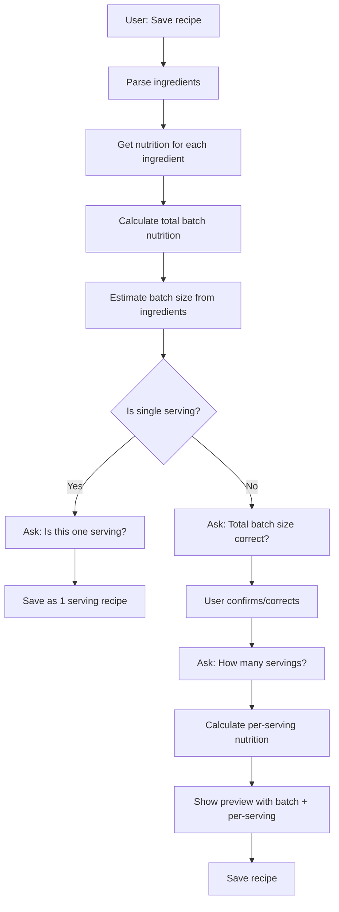

# Recipe System - Comprehensive Analysis & Redesign

## User Feedback Summary (2026-01-28)

**Current Problems**:
1. ✗ Recipe modal showing 0 calories
2. ✗ Recipe saved as "1 serving" for whole batch
3. ✗ Logging 5oz and 10oz gives same caloric value (0 cal)
4. ✗ No total batch size captured during recipe creation

**User's Vision**:
> Extract or ask user about recipe size (volume/weight/servings). Calculate total calories. Propose value to user. Ask about serving size. Works for both complex recipes (chicken soup) and simple ones (Italian salad with 1 tomato, 50g mozzarella, handful arugula). User can later log "1 portion" or "half portion".

---

## Root Cause Analysis

### Issue #1: Zero Calories in Recipe
**Problem**: Nutrition lookup fails for uncommon ingredients, no fallbacks used effectively.

**Evidence**:
- Ingredients like "high oleic safflower oil", "fennel bulb", "low-sodium chicken broth" fail API lookups
- Fallbacks exist but aren't being triggered
- No logging to show which ingredients fail

**Impact**: Recipe cards show "~0 kcal/batch", making them useless

---

### Issue #2: No Batch Size Calculation
**Problem**: System doesn't calculate or ask for total batch size during recipe creation.

**Current Flow**:
```
User pastes recipe → Parse ingredients → Get nutrition → Save
```

**Missing Steps**:
- Calculate total volume/weight from ingredients
- Ask user to confirm/correct batch size
- Ask how many servings the batch makes

**Impact**: Without batch size, portion scaling is impossible

---

### Issue #3: No Interactive Confirmation
**Problem**: Recipe creation is one-shot, no back-and-forth to refine data.

**What's Missing**:
- Batch size confirmation: "This makes ~700g total. Correct?"
- Serving size question: "How many servings does this make?"
- Nutrition preview: "Total batch: 1200 cal. Per serving (1/6): 200 cal"

**Impact**: User can't verify or correct calculations

---

### Issue #4: Single vs Batch Detection
**Problem**: System treats "1 tomato salad" same as "6-cup soup batch".

**Examples**:
- **Single Serving**: "Italian salad: 1 tomato, 50g mozzarella, handful arugula"
  - Should recognize as 1 serving
  - Ask: "Is this one serving?"
  - Save or log directly

- **Batch Recipe**: "Chicken soup: 6 cups broth, 500g chicken, 2 carrots"
  - Should recognize as multiple servings
  - Calculate batch size
  - Ask for serving count

**Impact**: Awkward UX for simple meals

---

## Proposed Architecture

### New Recipe Creation Flow



### Response Types Needed

1. **`recipe_batch_size_confirmation`**
   - Message: "This recipe makes about 700g total. Is that correct? (or specify: e.g., '6 cups', '4 servings')"
   - Metadata: `{ estimated_size, ingredients, batch_nutrition }`

2. **`recipe_serving_size_confirmation`**
   - Message: "How many servings does this make? (or specify serving size: e.g., '1 cup per serving')"
   - Metadata: `{ batch_size, batch_nutrition }`

3. **`recipe_single_serving_confirmation`**
   - Message: "Is this one serving of [recipe name]?"
   - Metadata: `{ ingredients, nutrition }`

---

## Technical Solutions

### Solution #1: Batch Size Calculator

**File**: `packages/supabase/functions/chat-handler/utils/batch-calculator.ts` (NEW)

```typescript
interface IngredientWithPortion {
  name: string
  portion: string  // "2 cups", "500g", "1 tbsp"
}

export function calculateBatchSize(ingredients: IngredientWithPortion[]): {
  size: number
  unit: string
  confidence: 'high' | 'medium' | 'low'
} {
  // 1. Parse all portions and convert to common units
  // 2. Sum volumes (cups, ml, liters) → total volume
  // 3. Sum weights (g, kg, oz, lb) → total weight
  // 4. Return dominant measurement
  // 5. Confidence based on how many ingredients had measurable portions
  
  // Example:
  // Input: ["2 cups flour", "500g chicken", "1 cup water"]
  // Output: { size: 3, unit: "cups", confidence: "medium" }
  //   OR: { size: 700, unit: "g", confidence: "medium" }
}
```

**Algorithm**:
1. Extract quantity + unit from each portion
2. Convert to base units (ml for volume, g for weight)
3. Sum all volumes, sum all weights
4. Return whichever is larger/more complete
5. Convert back to user-friendly unit (cups, oz, etc.)

---

### Solution #2: Single Serving Detector

**File**: `packages/supabase/functions/chat-handler/utils/serving-detector.ts` (NEW)

```typescript
export function isSingleServing(ingredients: IngredientWithPortion[]): boolean {
  // Heuristics:
  // 1. Total weight < 300g → likely single serving
  // 2. Contains phrases: "1 tomato", "handful", "50g" → single serving
  // 3. Contains phrases: "6 cups", "500g", "batch", "makes" → multiple servings
  // 4. Ingredient count < 5 AND small portions → single serving
  
  const totalWeight = calculateTotalWeight(ingredients)
  const hasSmallPortions = ingredients.every(ing => isSmallPortion(ing.portion))
  const hasBatchKeywords = ingredients.some(ing => 
    /batch|makes|yields|serves/i.test(ing.portion)
  )
  
  return totalWeight < 300 && hasSmallPortions && !hasBatchKeywords
}
```

---

### Solution #3: Multi-Step Recipe Agent

**File**: `packages/supabase/functions/chat-handler/agents/recipe-agent.ts` (UPDATE)

**New Actions**:
```typescript
type RecipeAction = 
  | { type: 'parse', text: string }
  | { type: 'confirm_batch_size', size: string }
  | { type: 'confirm_servings', servings: number | serving_size: string }
  | { type: 'save', recipe: ParsedRecipe }
  | { type: 'find', name: string }
```

**New Flow**:
```typescript
// Step 1: Parse
if (action.type === 'parse') {
  const parsed = await parseRecipe(action.text)
  const nutrition = await getNutrition(parsed.ingredients)
  const batchNutrition = sumNutrition(nutrition)
  const estimatedSize = calculateBatchSize(parsed.ingredients)
  
  if (isSingleServing(parsed.ingredients)) {
    return {
      response_type: 'recipe_single_serving_confirmation',
      message: `Is this one serving of ${parsed.name}?`,
      data: { parsed, nutrition: batchNutrition }
    }
  } else {
    return {
      response_type: 'recipe_batch_size_confirmation',
      message: `This recipe makes about ${estimatedSize.size}${estimatedSize.unit}. Correct?`,
      data: { parsed, batchNutrition, estimatedSize }
    }
  }
}

// Step 2: Confirm batch size
if (action.type === 'confirm_batch_size') {
  return {
    response_type: 'recipe_serving_size_confirmation',
    message: `How many servings does this make? (or specify: "1 cup per serving")`,
    data: { ...metadata, total_batch_size: action.size }
  }
}

// Step 3: Confirm servings
if (action.type === 'confirm_servings') {
  const perServingNutrition = scaleNutrition(
    metadata.batchNutrition, 
    1 / action.servings
  )
  
  return {
    response_type: 'recipe_preview',
    message: `
      **${metadata.parsed.name}**
      Total batch: ${metadata.batchNutrition.calories} cal
      Per serving (1/${action.servings}): ${perServingNutrition.calories} cal
      
      Ready to save?
    `,
    data: {
      ...metadata,
      servings: action.servings,
      per_serving_nutrition: perServingNutrition
    }
  }
}
```

---

### Solution #4: Intent Router Updates

**File**: `packages/supabase/functions/chat-handler/services/intent-router.ts` (UPDATE)

**New Handlers**:
```typescript
// Handle batch size confirmation
private async handleRecipeBatchConfirmation(
  intentResult: IntentExtraction,
  context: AgentContext,
  response: AgentResponse
): Promise<any> {
  const lastMsg = await getLastBotMessage(context)
  const metadata = lastMsg.metadata
  
  // Extract batch size from user response
  const batchSize = extractBatchSize(context.userMessage) || metadata.estimatedSize
  
  // Move to serving size question
  const recipeAgent = new RecipeAgent()
  return await recipeAgent.execute({
    type: 'confirm_batch_size',
    size: batchSize
  }, context)
}

// Handle serving size confirmation
private async handleRecipeServingConfirmation(
  intentResult: IntentExtraction,
  context: AgentContext,
  response: AgentResponse
): Promise<any> {
  const lastMsg = await getLastBotMessage(context)
  const metadata = lastMsg.metadata
  
  // Extract servings from user response
  const servings = extractServings(context.userMessage) || 1
  
  // Show final preview
  const recipeAgent = new RecipeAgent()
  return await recipeAgent.execute({
    type: 'confirm_servings',
    servings
  }, context)
}
```

---

## Implementation Plan

### Phase 1: Utilities (Foundation)
- [ ] Create `batch-calculator.ts` with `calculateBatchSize()`
- [ ] Create `serving-detector.ts` with `isSingleServing()`
- [ ] Create `portion-parser.ts` with unit conversion utilities
- [ ] Add tests for batch size calculation

### Phase 2: Recipe Agent Updates (Core)
- [ ] Add new action types to RecipeAgent
- [ ] Implement multi-step recipe creation flow
- [ ] Update parsing to extract batch size hints
- [ ] Add nutrition aggregation logic

### Phase 3: Intent Router (Handlers)
- [ ] Add `handleRecipeBatchConfirmation`
- [ ] Add `handleRecipeServingConfirmation`
- [ ] Add `handleRecipeSingleServingConfirmation`
- [ ] Update routing logic for new response types

### Phase 4: Database Schema (if needed)
- [x] Already added `total_batch_size` and `serving_size` columns
- [ ] Consider adding `batch_nutrition` JSONB column
- [ ] Consider adding `per_serving_nutrition` JSONB column

### Phase 5: Testing & Refinement
- [ ] Test complex recipe (chicken soup)
- [ ] Test simple recipe (Italian salad)
- [ ] Test batch size estimation accuracy
- [ ] Test serving size calculations
- [ ] Test portion logging with new data

---

## Priority Issues to Fix First

### 1. CRITICAL: Fix Zero Calories
**Why**: Blocks all recipe functionality
**How**: 
- Add detailed logging to see which ingredients fail
- Verify fallback logic is triggered
- Add more fallback entries

### 2. HIGH: Implement Batch Size Calculator
**Why**: Core feature for portion scaling
**How**: Create `batch-calculator.ts` utility

### 3. HIGH: Add Interactive Confirmation
**Why**: Improves data quality and UX
**How**: Update RecipeAgent with multi-step flow

### 4. MEDIUM: Single Serving Detection
**Why**: Better UX for simple meals
**How**: Create `serving-detector.ts` heuristic

---

## Testing Scenarios

### Scenario 1: Complex Recipe (Chicken Soup)
```
User: "Save this recipe: 6 cups chicken broth, 500g chicken breast, 2 carrots, 1 onion"
System: "This recipe makes about 7 cups total. Is that correct?"
User: "Yes, it makes 6 cups"
System: "How many servings does this make?"
User: "6 servings"
System: "Total batch: 800 cal. Per serving: 133 cal. Ready to save?"
User: "Yes"
System: "Saved! You can log it later with 'log chicken soup'"
```

### Scenario 2: Simple Recipe (Italian Salad)
```
User: "I had an Italian salad: 1 tomato, 50g mozzarella, handful of arugula"
System: "Is this one serving of Italian salad?"
User: "Yes"
System: "Got it! 180 cal. Save as a recipe or just log it?"
User: "Save it"
System: "Saved as 'Italian Salad' (1 serving, 180 cal)"
```

### Scenario 3: Portion Logging
```
User: "Log chicken soup"
System: "How much of Lemon-Dill Mediterranean Chicken Soup did you have?"
User: "1 cup"
System: "1 cup of chicken soup: 133 cal. Log it?"
User: "Yes"
System: "Logged!"
```

---

## Summary

**Current State**: Recipe system is broken due to missing batch size tracking and poor nutrition lookup.

**Proposed Solution**: 
1. Calculate batch size from ingredients
2. Interactive confirmation flow (batch size → servings → preview)
3. Detect single vs batch recipes
4. Better nutrition fallbacks
5. Proper portion scaling with batch size

**Next Steps**:
1. Fix zero calories issue (logging + fallbacks)
2. Implement batch calculator utility
3. Update RecipeAgent for multi-step flow
4. Add confirmation handlers to IntentRouter
5. Test end-to-end
